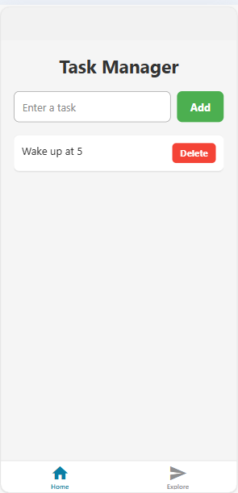
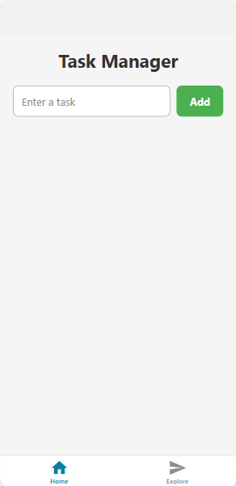
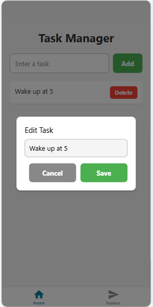
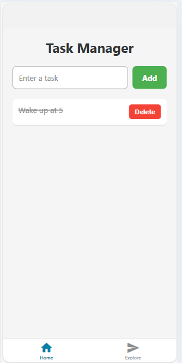

# Task Manager App 📝

A simple **React Native Task Manager** with animations, persistent storage, and a professional UI.  
This app allows users to **add, delete, edit, and mark tasks as completed**. It works on both **Android and iOS** and stores tasks locally using **AsyncStorage**.

---


## **Features**

- ✅ Add new tasks
- ✅ Delete tasks with smooth animation
- ✅ Mark tasks as completed (strike-through)
- ✅ Edit tasks on long press (modal input)
- ✅ Persistent storage using AsyncStorage
- ✅ Professional UI with shadows, rounded buttons, and card-style tasks
- ✅ Smooth LayoutAnimation for all changes
- ✅ Cross-platform (Android + iOS)

---

## **Screenshots**

### Task List



### Add Task



### Edit Task (Modal)



### Completed Task



*(Replace above screenshots with your actual images)*

---

## **Tech Stack**

- **React Native**  
- **Expo CLI** for development  
- **TypeScript** (optional, can be plain JS)  
- **AsyncStorage** for local storage  
- **LayoutAnimation** for smooth add/delete animations  

---

## **Getting Started**

### **Requirements**

- Node.js ≥ 18  
- npm ≥ 10  
- Expo Go app on your Android/iOS device or emulator  

### **Install Dependencies**

```bash
npm install
